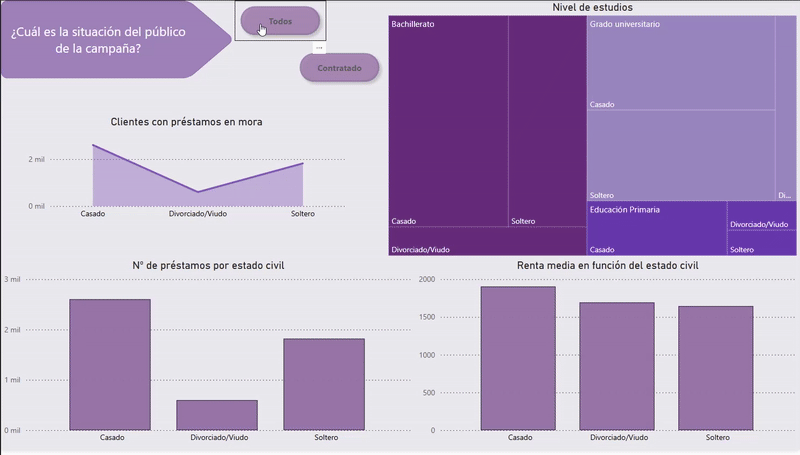
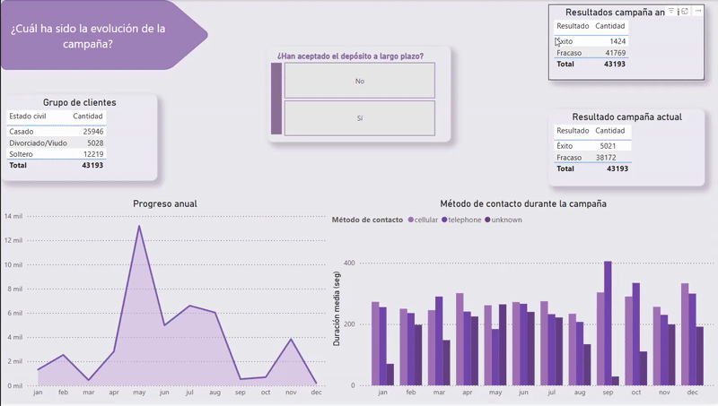

#  🏦Análisis de Campaña Bancaria para Contratación de Depósitos a Plazo
Este proyecto tiene como objetivo analizar las características de los clientes y su relación con la contratación de un depósito a plazo fijo, utilizando técnicas de análisis exploratorio de datos (EDA). Se comienza con una base de datos con múltiples variables sociodemográficas, financieras y de comportamiento, para evaluar patrones e insights que permitan una mejor toma de decisiones en futuras campañas de marketing, ademas de facilitar información de la campaña anterior a la del análisis.


### 🤔 Preguntas a responder

- ¿Cuál ha sido el resultado de la campaña?
- ¿Cómo se comportan los clientes?
- ¿Hay algún grupo con mayor nivel de contratación?
- ¿Que varíables se han de tener en cuenta en el modelo?


### 📁 Estructura del proyecto
```
├── data/        `→`  Archivos de datos sin procesar y finalizado
│   ├── raw/
│   └── processed/
├── notebooks/       `→`   Notebooks con el análisis y estructura del proyecto
├── dashboards/      `→`  Presentación / Dashboard del proyecto
├── src/             `→` Contiene de forma estructurada
│   ├── etl.py
│   ├── eda.py
│   └── stats.py
├── requirements.txt  `→`  Entorno con las librerías necesarias para desarrollar el proyecto
├── .gitignore
└── README.md
```

###  👓 Objetivos del proyecto

- Explorar la distribución y el impacto de las variables del modelos como edad, estado civil, saldo, ocupación, duración de la llamada, etc.

- Evaluar el impacto de cada variable en la decisión del cliente de contratar o no el producto de la campaña --> variable **y** == **fixed_term_deposit**

- Detectar correlaciones o patrones que puedan influir en la contratación.

- Proponer transformaciones o limpieza de datos según la calidad de las variables que faciliten el análisis o extraigan el mayor potencial de la variable.


### 🔍 Contenido del análisis

1. Limpieza y preparación de los datos.
Eliminación de valores Unknown en columnas como studies y job.

Agrupación en rango de valores para variables como age en age_group

Conversión de variables categóricas.

Detección y tratamiento de valores atípicos.


2. Análisis exploratorio (EDA)

Distribución de variables numéricas (age, balance, duration, etc.).

Distribución de variables categóricas (job, marital, education, etc.).

Análisis por separado de los clientes que contrataron el depósito (yes) y los que no (no).

Uso de histogramas, boxplots y gráficos de barras.


3. Evaluación de correlaciones e hipótesis de contrastes.
Matriz de correlación entre variables numéricas.

Revisión de redundancias.

Discusión sobre variables que pueden o no aportar valor al modelo predictivo.

Evaluación del nivel de implicación de las variables categóricas a la hora de decidir si contratar el producto.


### 🎞️ Dashboard
En esta campaña se contactó con los clientes vía telefónica.
Para ellos, he decido analizar la situación de los distintos grupos de clientes que podemos encontrar por tipo de trabajo. 
Podemos ver como, a través del gráfico de barras, se distribuyen los clientes de la entidad bancaria, concentrándose gran parte de su volumen en trabajadores del área de construcción, en puestos de dirección o técnicos. El hecho de que los valores se centren en su mayoría en unos grupos de trabajo en sí, no implica que la campaña debe ir plenamente enfocados en estos. ¿Por qué? Esto se debe a que debemos tener en cuenta otro tipo de variables ya que si nos paramos a analizar el porcentaje de contratación para cada uno de ellos se pueden apreciar diferencias significativas como es el caso de los obreros que ha pesar de ser tantos, tiene la menor ratio de aceptación del producto ofrecido y por el contrario los jubilados es el grupo que más ha contratado dicho producto.

Del total tenemos que tan solo 11.62% de los clientes de la entidad llegaron a contratar el producto y si nos fijamos en el promedio de edad se puede detectar un patrón de comportamiento en el que parece ser que por cada grupo, las personas con mayor a edad y con un nivel mayor de renta tienden a su contratación.


También hay que preguntarse ¿Cuál es la situación del público de la campaña?
Vemos que ha nivel general el nivel de estudios de gran parte de los contactados en la campaña tienen un nivel de estudios medio, se encuentran casados y parte de ellos cuentan con préstamos, ya sean hipotecarios o personales. Aquí se confirma que además de los casados ser el grupo con un nivel de renta mayor y a su vez, contar con un número de prestamos contratados mayor, la renta, al analizar al grupo que ha contratado el producto financiero mayor, por lo que se afirma en mayor medida la hipótesis de que la probabilidad de que un individuo acepte el producto es mayor, cuanto mas alta sea su renta.




Ya habiendo realizado un pequeño análisis sobre la situación del público de la campaña, hemos de plantearnos, ¿Cuál ha sido la evolución de esta? Pues para comenzar, con respecto a la campaña anterior, los resultados de han mejorado notablemente, dado que para el mismo número de clientes contactados, el número de éxito aumentó en casi 4000 personas. 
¿Y cuando fueron los picos de contratación? Pues estos se dieron durante el mes de mayo y agosto con un total de 888 y 659 respectivamente. ¿Y si quisiéramos profundizar más aun, del grupo de clientes quienes fueron los que más contrataron el producto esos meses? Pues en primer los casados seguidos de los solteros.
Por ello, se debería enfocar en profundidad para campañas futuras de este tipo de productos en un segmento de clientes con un poder adquisitivo medio que ronde o supere los 1500€ anuales, que cuenten con un nivel de estudio medio-alto y que sean contactados a sus teléfonos móviles en mayor medida en los meses de mayo y agosto. Además de que en caso de que no aceptase tras la primera llamada pero la duración de esta fuese elevada, se debería intentar contactar de nuevo debido a que ha mayor duración de la llamada, mayor nivel de contratación se detecta.




### 📈 Principales resultados

La campaña ha tenido un nivel de contratación superior al del año anterior

La mayoría de las variables no muestran una fuerte correlación directa con el objetivo, lo que sugiere la necesidad de combinar múltiples factores para generar una predicción fiable.

Las categorías como Unknown en job y education no aportan valor y se han eliminado.

Tras analizar las variables a traves de contrastes de hipótesis y visualización de comportamiento a través de agrupaciones y vizualizaciones se detecta que en las próximas campañas, se debe perfilar un poco más el segmento del clientes al que se dirige la campaña.
Con esto se quiere decir que tendría un mayor nivel de éxito dirigiendose a estudiantes y jubilados al terner un mayor ratio de contratación, además de dirigirse a personas casadas o con ingresos iguales o mayores a 1500€ y un nivel de estuios medio - alto.

EL grupo con mayor nivel de contratación son los casados y los directivos, pero los que cuentan con uyn mayor ratio de aceptación son los estudiantes

### 🛠 Tecnologías utilizadas
- Python (3.10+)

- Pandas

- Numpy

- Matplotlib

- Seaborn

- scipy.stats

-statsmodels.stats

- Jupyter Notebook